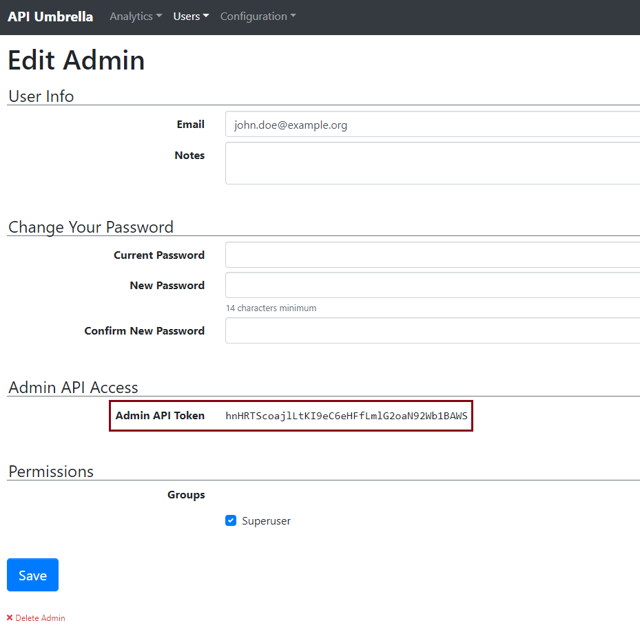
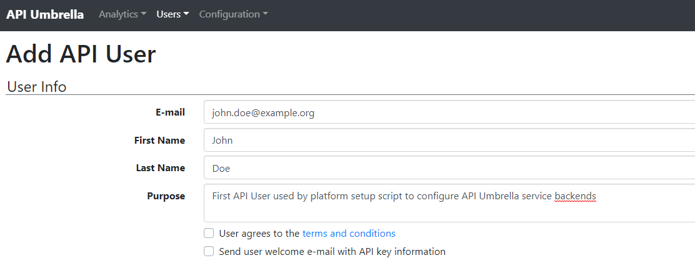
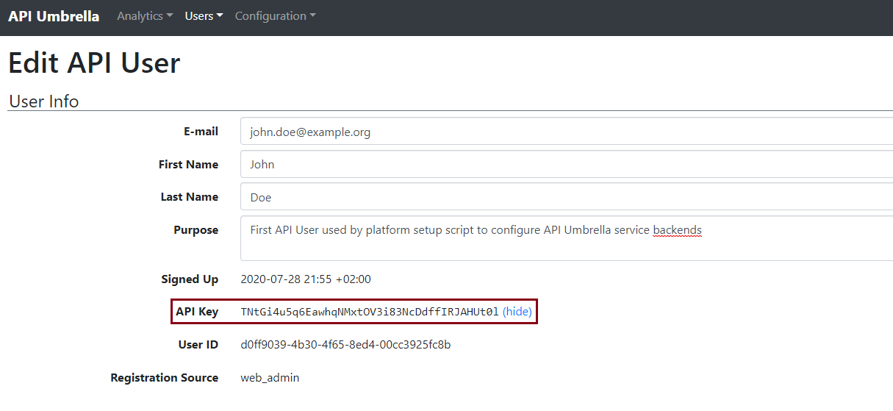
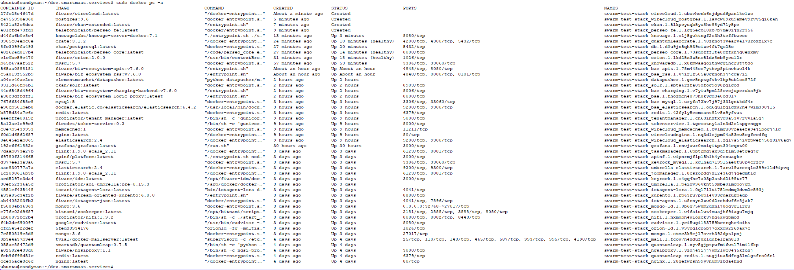

# Smart-Platform-Services

[](https://www.fiware.org/developers/catalogue/)
[](http://fiware-ges.github.io/orion/api/v2/stable/)
[](https://www.etsi.org/deliver/etsi_gs/CIM/001_099/009/01.02.01_60/gs_cim009v010201p.pdf)
[](./processing/README.md)
[](./processing/README.md)
[](./processing/README.md)
[](./data-publication/README.md)
[](./data-publication/README.md)
[](./data-publication/README.md)
[](./security/README.md)
[](https://opensource.org/licenses/AGPL-3.0)

<b>Smart-Platform-Services</b> is a set of directories which contains Docker service YAMLs and configuration files of <b>FIWARE Foundation</b> Generic Enablers (GE) necessary to setup an initial Smart Platform. The whole stack is deployed and managed under a Docker Swarm Cluster.

Smart-Platform-Services consists of three directories, `services`, `config` and `scripts`:

- `services` directory consists of all the Docker YAML files which contain instructions for the deployment of the FIWARE GE.
- `config` directory consists of all the configuration files needed by the Docker services YAML files.
- `scripts` directory holds two setup scripts used for automatic configuration and setup/deployment of the platform.

<u><i>Note</i></u>: The following manual was written for deployments on Ubuntu/Debian-alike systems. The scripts were tested on a system with Ubuntu 18.04. No warranty can be given for compatibility with other versions or linux distributions.

## Content ##
- [Prerequisites](#prerequisites)
- [How to deploy?](#how-to-deploy)
- [Services incorporated](#services-incorporated)
- [Platform flowchart](#platform-flowchart)
- [Known issues](#known-issues)
- [Contribution](#contribution)
- [License](#license)

## Prerequisites ##
Before you set up the platform on your VM or server, a few prerequisites must be fulfilled:

- Make sure that your machine has sufficient (V)CPU and RAM. We recommend as an <b>absolute minimum</b> a configuration of <b>8 (V)CPUs / 16 GB RAM</b>. However, <b>16 (V)CPUs / 32 GB RAM</b> or more are <b>better</b> to provide sufficient resources for all services. Practice has shown that a larger configuration significantly improves both response times and inter-service communication.
- You need a managable domain `<domain-name>` with control over DNS records and the possibility of creating additional subdomains. These subdomains will be used to access the various web interfaces and services the platform is composed of.  
The following subdomains must be created:

	* `accounts`.\<domain-name\>  
	<i>Needed for: [Keyrock - Identity Management](https://github.com/ging/fiware-idm)</i>
	* `apis`.\<domain-name\>  
	<i>Needed for: [APInf - API Management Framework](https://github.com/apinf/platform)</i>
	* `cadvisor`.\<domain-name\>  
	<i>Needed for: [cAdvisor - Docker Monitoring](https://github.com/google/cadvisor)</i>
	* `charts`.\<domain-name\>  
	<i>Needed for: [Grafana - Open source analytics & monitoring](https://github.com/grafana/grafana)</i>
	* `dashboards`.\<domain-name\>  
	<i>Needed for: [Wirecloud - Web dashboard platform](https://github.com/Wirecloud)</i>
	* `data`.\<domain-name\>  
	<i>Needed for: [CKAN - Open Data publication platform](https://github.com/conwetlab/FIWARE-CKAN-Extensions)</i>
	* `knowage`.\<domain-name\>  
	<i>Needed for: [Knowage - Business Intelligence platform](https://github.com/KnowageLabs)</i>
	* `market`.\<domain-name\>  
	<i>Needed for: [Marketplace based on Biz Framework - Context API/Data monetization](https://github.com/FIWARE-TMForum/Business-API-Ecosystem)</i>
	* `ngsiproxy`.\<domain-name\>  
	<i>Needed for: [NGSI Proxy - Redirection of NGSI notifications to web pages](https://github.com/conwetlab/ngsi-proxy)</i>
	* `nifi`.\<domain-name\>  
	<i>Needed for: [Apache NiFi - Data flow and transformation](https://github.com/apache/nifi)</i>
	* `perseo`.\<domain-name\>  
	<i>Needed for: [Perseo - Complex Event Processing (CEP)](https://github.com/telefonicaid/perseo-core)</i>
	* `umbrella`.\<domain-name\>  
	<i>Needed for: [APInf Umbrella - open source API management platform (based on API Umbrella)](https://github.com/Profirator/api-umbrella)</i>

- Make sure you can provide an e-mail address used by certbot (tool for setting up [Let's Encrypt](https://letsencrypt.org) certificates) for account registration and recovery. All externally exposed services will be served via HTTPS.

- Allow incoming traffic on port 443 (HTTPS) on your VM.

- You must have a SMTP server ready for sending out e-mails to the platform users (register at a provider of your choice or set up a server on your own which won't be covered by this guide).

## How to deploy? ##

**Preperation of VM**

First of all, update/upgrade your VM and install some additional packages.

```bash
sudo apt-get update -y && sudo apt-get upgrade -y && sudo apt-get install -y zip unzip git
```

Deploy wildcard certificates from Let's Encrypt for your domain.  
Before executing the certbot command, please replace `<email>` with your e-mail address used for account registration and recovery of your certificates, e.g. `me@example.org`  
Please also change the placeholder `<domain-name>` to your domain name, e.g. `mydomain.org`

```bash
sudo apt-get update -y && sudo apt-get install software-properties-common -y

sudo add-apt-repository universe -y && sudo add-apt-repository ppa:certbot/certbot -y && sudo apt-get update -y && sudo apt-get install certbot python-certbot-nginx -y

sudo certbot certonly --manual --preferred-challenges dns-01 --server https://acme-v02.api.letsencrypt.org/directory --email <email> --no-eff-email --manual-public-ip-logging-ok --agree-tos -d *.<domain-name>
```

After running the above command, add the DNS TXT record provided by Let’s Encrypt certbot to your DNS server.


**Step 1 - Check out the project files:**

Checkout this repository with your Git credentials.

```bash
git clone https://github.com/SmartMaaS-Services/dev.smartmaas.services.git
```

**Step 2 - Deploy docker services in a Docker Swarm:**

Change to your local repo directory. It currently contains two setup scripts for configuration and setup of the platform services which are going to be deployed as Docker services. Be sure to have execution rights set for both scripts.

```bash
cd dev.smartmaas.services
chmod u+x scripts/setup-part*
```
Deploy services in Docker Swarm by running the first script. The following options are supported:

<pre>
<i>Mandatory options:</i>  
<b>--login-user</b>  logged-in (or SSH) user that will be added to the docker user group 
<b>--smtp-server</b> SMTP server address  
<b>--smtp-user</b>   SMTP account user  
<b>--smtp-pwd</b>    SMTP account password  
<b>--domain</b>      domain name  
<b>--stack</b>       stack name for the Docker Swarm - can be chosen freely and will be used as name prefix for Docker container and networks 

<i>Optional options:</i> 
<b>--version</b>     prints out the script's version  
<b>--help</b>        prints out usage information and these options
</pre>

<u><i>Note</i></u>: Put option values into single quotes ('') to prevent special characters from being interpreted by the shell.

```bash
./scripts/setup-part1.sh --login-user '<linux-login-user>' 
			 --smtp-server '<smtp-server>' --smtp-user '<smtp-user>' --smtp-pwd '<smtp-password>'
			 --domain '<domain-name>' --stack '<swarm-stack-name>'
```

**Step 3 - APInf Umbrella configuration and Keyrock Identity Manager (IDM) setup:**

Open <b><i>https://<span></span>umbrella.<code>&lt;domain-name&gt;</code>/admin</i></b> in your browser and register the first user - the admin - for the installed [APInf Umbrella](https://github.com/Profirator/api-umbrella) service. APInf Umbrella (a fork of [API Umbrella](https://apiumbrella.io/)) acts as a proxy that sits in front of the services of the Smart Platform and adds functionality like API keys, rate limiting, and analytics. 

<p align="center">
	
</p>

After creation of the admin user you should be redirected to the management dashboard of APInf Umbrella. 

- Go to `'Users' -> 'Admin Accounts'` and select the admin account you've just created by clicking its e-mail address. Copy the Admin API Token and put it in place of `<admin-auth-token>` from the next command.

<p align="center">
	
</p>

- The internal Admin API of APInf Umbrella requires an additional standard user to perform admin requests. These requests will be sent by the second setup script to make the services of the platform (each addressed by one of the created subdomains) reachable behind APInf Umbrella.  
Go to `'Users' -> 'API Users'` and add a new API user. Fill out the `User Info` section (you can use the same e-mail address as the admin user) and click "Save".

<p align="center">
	
</p>

- The new account should appear in the list of API users. Open it, copy the user's API Key and replace the `<api-key>` placeholder in the shell command.

<p align="center">
	
</p>

<u><i>Note</i></u>: Also don't forget about the single quotes ('') here.

```bash
./scripts/setup-part2.sh --domain '<domain-name>' --api-key '<api-key>'
			 --token '<admin-auth-token>' --stack '<swarm-stack-name>'
```

## Services incorporated ##

```
apinf, bae, bae_apis, bae_charging, bae_elasticsearch, bae_mysql, bae_rss, cadvisor, ckan, datapusher, db, grafana, iot-agent, iotagent-lora, jobmanager, keyrock, keyrock_mysql, knowage, knowagedb, kurento, mail, mongo, mongo-ld, nginx, ngsiproxy, nifi, orion, orion-ld, perseo-core, perseo-fe, quantumleap, quantumleap_redis, quantumleapcrate, redis, solr, taskmanager, tenantmanager, tokenservice, umbrella, umbrella_elasticsearch, wirecloud, wirecloud_elasticsearch, wirecloud_memcached, wirecloud_postgres, wirecloudnginx, zookeeper
```

After executing both setup scripts, all of the following Docker services above (currently 46) should be up and running.

Verify using
```bash
sudo docker ps -a
```
<p align="center">
	
</p>

or using
```bash
sudo docker service ls
```
<p align="center">
	
</p>

## Platform flowchart ##

<p align="center">
	
</p>

## Known issues ##

### Missing Docker services ###

When checking the list of Docker services on your VM, you may notice that some of them are missing. While deploying the YML services for the Smart Platform by executing the command `sudo docker stack deploy -c <YML-file>...` in part 1 of the setup script, not all of the specified services make it into the Swarm stack for reasons unknown so far, which is why required containers are missing. This leads to other containers being continuously exited and restarted because the depending services they contain cannot be connected to the needed services.

Hence it may be necessary to manually repeat the `sudo docker stack deploy -c <YML-files>...` command several times to finally have all needed services in Docker swarm. The output of this command should give a good hint whether deployment was successful or not. The line `Creating service <swarm-stack-name>_<service-name>` is usually a good sign.  
If you afterwards find more than one container for a specific service listed by `sudo docker ps -a`, you are safe removing these containers via `sudo docker rm <container>`.   

The problem could be related to different start times during deployment. This is the case, for example, if a required service has not yet been placed in the Swarm stack because it is still being deployed, but another service that needs it is already operational.  
It may also take some time to get ALL services up and running. They may stay in "Created" state for quite a while before switching to "Up". This is not problematic per se, but could lead to the dependency problems mentioned above.

## Contribution ##

Pull requests are welcome. Please make sure to update tests as appropriate.
Git conventions are being followed and changes go to development only from feature/bugfix branches.

## License ##

Smart-Platform-Services is licensed under Affero General Public License (GPL) version 3.

© 2020 FIWARE Foundation
